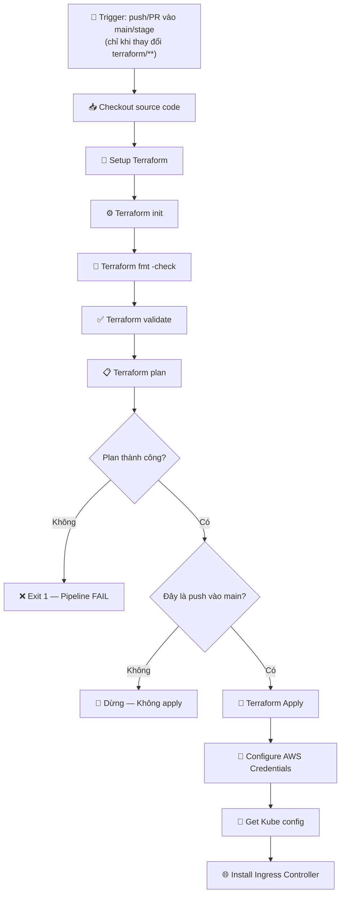

# Giải Thích Chi Tiết: `workflow.yaml`

> [!NOTE]
> Đây là file **GitHub Actions Workflow** — một pipeline CI/CD tự động chạy trên GitHub. Mục đích chính là: **tự động triển khai hạ tầng AWS (VPC, EKS Cluster) bằng Terraform** và **cài đặt Ingress Controller trên EKS** mỗi khi có thay đổi code Terraform.

---

## Tổng Quan Kiến Trúc Pipeline



---

## 1. `name` — Tên Workflow (Dòng 1)

```yaml
name: "Vprofile IAC"
```

- Đặt tên cho workflow là **"Vprofile IAC"** (Infrastructure as Code).
- Tên này sẽ hiển thị trên tab **Actions** của GitHub repository.
- Giúp phân biệt workflow này với các workflow khác trong project.

---

## 2. `on` — Trigger (Điều kiện kích hoạt) (Dòng 2–13)

```yaml
on:
  push:
    branches:
      - main
      - stage
    paths:  
      - terraform/**
  pull_request:
    branches:
      - main
    paths:
      - terraform/**
```

### Giải thích từng phần:

| Trigger | Branch | Paths | Ý nghĩa |
|---------|--------|-------|----------|
| `push` | `main`, `stage` | `terraform/**` | Workflow chạy khi có **push** (commit trực tiếp hoặc merge) vào branch `main` hoặc `stage`, **nhưng chỉ khi** có thay đổi trong thư mục `terraform/` |
| `pull_request` | `main` | `terraform/**` | Workflow chạy khi có **Pull Request** nhắm đến branch `main`, **nhưng chỉ khi** PR có thay đổi trong thư mục `terraform/` |

> [!IMPORTANT]
> **`paths: terraform/**`** là bộ lọc rất quan trọng! Nó đảm bảo workflow **KHÔNG chạy** khi bạn chỉ thay đổi file README, code ứng dụng, hay bất kỳ thứ gì ngoài thư mục `terraform/`. Điều này tiết kiệm thời gian chạy CI/CD và tránh triển khai hạ tầng không cần thiết.

### Sự khác biệt giữa `push` và `pull_request`:
- **`push` vào `main`**: Workflow sẽ chạy **đầy đủ** bao gồm cả `terraform apply` (triển khai thực tế).
- **`push` vào `stage`**: Workflow chạy nhưng sẽ **KHÔNG `apply`** (chỉ chạy plan để kiểm tra).
- **`pull_request` vào `main`**: Workflow chạy để **review/kiểm tra** trước khi merge, cũng **KHÔNG `apply`**.

---

## 3. `env` — Biến Môi Trường (Dòng 15–22)

```yaml
env:
 AWS_ACCESS_KEY_ID: ${{ secrets.AWS_ACCESS_KEY_ID }}
 AWS_SECRET_ACCESS_KEY: ${{ secrets.AWS_SECRET_ACCESS_KEY }}
 BUCKET_TF_STATE: ${{ secrets.BUCKET_TF_STATE }}
 AWS_REGION: us-east-2
 EKS_CLUSTER: vprofile-eks
```

### Chi tiết từng biến:

| Biến | Giá trị | Mục đích |
|------|---------|----------|
| `AWS_ACCESS_KEY_ID` | `${{ secrets.AWS_ACCESS_KEY_ID }}` | Access Key của IAM User trên AWS, được lưu an toàn trong **GitHub Secrets** |
| `AWS_SECRET_ACCESS_KEY` | `${{ secrets.AWS_SECRET_ACCESS_KEY }}` | Secret Key tương ứng, cũng lưu trong **GitHub Secrets** |
| `BUCKET_TF_STATE` | `${{ secrets.BUCKET_TF_STATE }}` | Tên S3 bucket dùng để lưu **Terraform state file** (remote backend) |
| `AWS_REGION` | `us-east-2` | AWS Region (Ohio) — nơi hạ tầng sẽ được triển khai |
| `EKS_CLUSTER` | `vprofile-eks` | Tên EKS cluster sẽ được tạo/quản lý |

> [!CAUTION]
> **`secrets.*`** là cơ chế bảo mật của GitHub. AWS credentials **KHÔNG BAO GIỜ** được hardcode trực tiếp trong file YAML. Chúng phải được cấu hình trong **Settings → Secrets and variables → Actions** của repository GitHub.

> [!TIP]
> `${{ secrets.BUCKET_TF_STATE }}` — Tên bucket cũng được lưu secret vì đây là thông tin nhạy cảm liên quan đến cấu hình backend. Điều này cho phép sử dụng các bucket khác nhau cho các môi trường khác nhau mà không cần sửa code.

---

## 4. `jobs` — Định Nghĩa Công Việc (Dòng 24–31)

```yaml
jobs:
   terraform:
     name: "Apply terraform code changes"
     runs-on: ubuntu-latest
     defaults:
       run:
         shell: bash
         working-directory: ./terraform
```

### Chi tiết:

| Thuộc tính | Giá trị | Ý nghĩa |
|------------|---------|----------|
| `terraform` | — | Tên **ID** của job (dùng để tham chiếu nội bộ) |
| `name` | `"Apply terraform code changes"` | Tên **hiển thị** của job trên GitHub UI |
| `runs-on` | `ubuntu-latest` | Job chạy trên máy ảo **Ubuntu mới nhất** do GitHub cung cấp (GitHub-hosted runner) |
| `shell` | `bash` | Mọi lệnh `run` trong job này mặc định dùng **Bash shell** |
| `working-directory` | `./terraform` | Mọi lệnh `run` sẽ tự động chạy trong thư mục `./terraform` thay vì root của repo |

> [!NOTE]
> **`working-directory: ./terraform`** rất quan trọng! Thay vì phải gõ `cd terraform && terraform init`, bạn chỉ cần gõ `terraform init` và nó sẽ tự chạy trong đúng thư mục.

---

## 5. `steps` — Các Bước Thực Thi (Dòng 33–82)

### Step 1: Checkout Source Code (Dòng 34–35)

```yaml
- name: Checkout source code 
  uses: actions/checkout@v4
```

- **Mục đích**: Tải toàn bộ source code từ repository về runner (máy ảo).
- **`actions/checkout@v4`**: Đây là một **GitHub Action chính thức** phiên bản 4.
- **Tại sao cần?**: Máy ảo runner ban đầu **trống hoàn toàn** — không có code nào. Bước này clone repo vào runner để các bước sau có thể truy cập file Terraform.

---

### Step 2: Setup Terraform (Dòng 37–40)

```yaml
- name: Setup Terraform with specified version on the runner
  uses: hashicorp/setup-terraform@v2
  #with:
  #  terraform_version: 1.6.3
```

- **Mục đích**: Cài đặt Terraform CLI trên runner.
- **`hashicorp/setup-terraform@v2`**: Action chính thức từ HashiCorp (nhà phát triển Terraform).
- **Phần comment**: `terraform_version: 1.6.3` đang bị **comment out** (`#`), nghĩa là workflow sẽ dùng **phiên bản Terraform mới nhất** thay vì pin ở 1.6.3.

> [!WARNING]
> Việc không pin version Terraform có thể gây ra lỗi nếu phiên bản mới nhất có **breaking changes**. Trong production, nên uncomment và chỉ định version cụ thể để đảm bảo tính nhất quán.

---

### Step 3: Terraform Init (Dòng 42–44)

```yaml
- name: Terraform init
  id: init
  run: terraform init -backend-config="bucket=$BUCKET_TF_STATE"
```

- **Mục đích**: Khởi tạo Terraform — tải provider plugins (AWS), cấu hình backend.
- **`-backend-config="bucket=$BUCKET_TF_STATE"`**: Truyền tên S3 bucket **động** vào cấu hình backend. Giá trị `$BUCKET_TF_STATE` lấy từ biến môi trường (đã định nghĩa ở phần `env`).
- **`id: init`**: Gán ID cho step này để các step sau có thể tham chiếu kết quả (`steps.init.outcome`).

> [!NOTE]
> Lệnh này kết hợp với khối `backend "s3" {}` trong file `terraform.tf`. Thay vì hardcode tên bucket trong file `.tf`, ta truyền nó qua command line, cho phép linh hoạt giữa các môi trường.

---

### Step 4: Terraform Format Check (Dòng 46–48)

```yaml
- name: Terraform format
  id: fmt
  run: terraform fmt -check
```

- **Mục đích**: Kiểm tra xem code Terraform có đúng **chuẩn format** của HashiCorp không.
- **`-check`**: Flag này chỉ **kiểm tra** mà không tự sửa. Nếu có file nào không đúng format, lệnh sẽ **trả về lỗi** (exit code ≠ 0).
- **Ý nghĩa**: Đảm bảo tất cả code Terraform tuân thủ coding convention — giúp code dễ đọc và nhất quán.

---

### Step 5: Terraform Validate (Dòng 50–52)

```yaml
- name: Terraform validate
  id: validate
  run: terraform validate
```

- **Mục đích**: Kiểm tra **cú pháp** và **tính hợp lệ** của code Terraform.
- **Khác với `fmt`**: `fmt` chỉ kiểm tra format (thẩm mỹ), còn `validate` kiểm tra:
  - Cú pháp HCL có đúng không
  - Các block, attribute có hợp lệ không
  - Các tham chiếu variable/resource có tồn tại không
- **Không kết nối AWS**: Bước này chạy offline, không cần credentials.

---

### Step 6: Terraform Plan (Dòng 54–57)

```yaml
- name: Terraform plan
  id: plan
  run: terraform plan -no-color -input=false -out planfile
  continue-on-error: true
```

- **Mục đích**: Tạo **execution plan** — cho biết Terraform sẽ tạo/sửa/xóa những resource nào.
- **Các flag**:

| Flag | Ý nghĩa |
|------|----------|
| `-no-color` | Tắt ANSI color codes trong output (vì CI/CD log không hỗ trợ tốt) |
| `-input=false` | Không hỏi input từ user (vì đang chạy tự động, không có ai để trả lời) |
| `-out planfile` | Lưu plan vào file `planfile` để bước `apply` dùng lại (đảm bảo apply đúng những gì đã plan) |

- **`continue-on-error: true`**: Nếu plan **thất bại**, workflow **KHÔNG dừng ngay** mà tiếp tục sang step tiếp theo. Lý do: step tiếp theo sẽ xử lý lỗi một cách có kiểm soát.

---

### Step 7: Terraform Plan Status Check (Dòng 59–61)

```yaml
- name: Terraform plan status
  if: steps.plan.outcome == 'failure' 
  run: exit 1     
```

- **Mục đích**: Kiểm tra kết quả của bước Plan.
- **`if: steps.plan.outcome == 'failure'`**: Bước này **CHỈ chạy** khi plan thất bại.
- **`exit 1`**: Thoát với mã lỗi 1, khiến **toàn bộ workflow FAIL**.

> [!NOTE]
> **Tại sao không để plan fail trực tiếp?** Vì dùng `continue-on-error: true` ở step 6 cho phép GitHub ghi nhận output của plan (kể cả khi lỗi) trước khi quyết định fail. Đây là pattern phổ biến để có log đầy đủ hơn trong CI/CD.

---

### Step 8: Terraform Apply (Dòng 63–66)

```yaml
- name: Terraform Apply
  id: apple
  if: github.ref == 'refs/heads/main' && github.event_name == 'push'
  run: terraform apply -auto-approve -input=false -parallelism=1 planfile
```

- **Mục đích**: **Triển khai thực tế** hạ tầng lên AWS.
- **`id: apple`**: ⚠️ Có vẻ là **typo** — nên là `apply` thay vì `apple`. Mặc dù vẫn hoạt động (vì ID chỉ là tên tham chiếu), nhưng dễ gây nhầm lẫn.

#### Điều kiện `if` — RẤT QUAN TRỌNG:

```yaml
if: github.ref == 'refs/heads/main' && github.event_name == 'push'
```

| Điều kiện | Ý nghĩa |
|-----------|----------|
| `github.ref == 'refs/heads/main'` | **CHỈ** khi đang ở branch `main` |
| `github.event_name == 'push'` | **CHỈ** khi sự kiện là `push` (không phải `pull_request`) |
| `&&` | **CẢ HAI** điều kiện phải đúng |

> [!IMPORTANT]
> Điều này có nghĩa: **Terraform Apply CHỈ chạy khi push/merge vào branch `main`**. Nếu bạn push vào `stage` hoặc tạo PR, workflow chỉ chạy đến bước `plan` — cho phép review mà không triển khai.

#### Các flag của `apply`:

| Flag | Ý nghĩa |
|------|----------|
| `-auto-approve` | Tự động xác nhận, không hỏi "yes/no" (bắt buộc trong CI/CD) |
| `-input=false` | Không hỏi input |
| `-parallelism=1` | Chỉ tạo/sửa **1 resource tại một thời điểm** (tuần tự, không song song). Giúp tránh lỗi race condition khi các resource phụ thuộc lẫn nhau |
| `planfile` | Dùng plan đã lưu ở step 6, đảm bảo apply đúng những gì đã plan |

---

### Step 9: Configure AWS Credentials (Dòng 68–73)

```yaml
- name: Configure AWS credentials
  uses: aws-actions/configure-aws-credentials@v1
  with:
    aws-access-key-id: ${{ secrets.AWS_ACCESS_KEY_ID }}
    aws-secret-access-key: ${{ secrets.AWS_SECRET_ACCESS_KEY }}
    aws-region: ${{ env.AWS_REGION }}
```

- **Mục đích**: Cấu hình AWS CLI credentials cho các bước tiếp theo (`aws eks`, `kubectl`).
- **`aws-actions/configure-aws-credentials@v1`**: Action chính thức từ AWS.
- **Tại sao cần khi đã có `env`?**: Phần `env` ở trên cung cấp biến môi trường cho Terraform. Bước này cấu hình credentials theo cách mà **AWS CLI** và **kubectl** có thể sử dụng (thiết lập AWS profile).

---

### Step 10: Get Kube Config (Dòng 75–78)

```yaml
- name: Get Kube config file
  id: getconfig
  if: steps.apple.outcome == 'success'
  run: aws eks update-kubeconfig --region ${{ env.AWS_REGION }} --name ${{ env.EKS_CLUSTER }}
```

- **Mục đích**: Tải file **kubeconfig** từ EKS cluster để `kubectl` có thể kết nối.
- **`if: steps.apple.outcome == 'success'`**: Chỉ chạy nếu **Terraform Apply thành công** (tham chiếu ID `apple`).
- **`aws eks update-kubeconfig`**: Lệnh AWS CLI tự động thêm cluster info vào file `~/.kube/config` trên runner.
- **Kết quả**: Sau bước này, `kubectl` đã sẵn sàng giao tiếp với EKS cluster `vprofile-eks` ở region `us-east-2`.

---

### Step 11: Install Ingress Controller (Dòng 80–82)

```yaml
- name: Install Ingress controller
  if: steps.apple.outcome == 'success' && steps.getconfig.outcome == 'success'
  run: kubectl apply -f https://raw.githubusercontent.com/kubernetes/ingress-nginx/controller-v1.1.3/deploy/static/provider/aws/deploy.yaml
```

- **Mục đích**: Cài đặt **NGINX Ingress Controller** trên EKS cluster.
- **Điều kiện**: Chỉ chạy khi **CẢ** Terraform Apply VÀ Get Kube Config đều thành công.
- **`kubectl apply -f <URL>`**: Áp dụng manifest YAML trực tiếp từ GitHub URL — cài đặt phiên bản `v1.1.3` của NGINX Ingress Controller, được tùy chỉnh cho AWS (sử dụng NLB/ELB).

> [!NOTE]
> **Ingress Controller** là thành phần giúp định tuyến HTTP/HTTPS traffic từ bên ngoài vào các Service bên trong cluster Kubernetes. Không có nó, bạn không thể expose ứng dụng qua domain name.

---

## Tóm Tắt Luồng Hoạt Động

| Giai đoạn | Steps | Luôn chạy? | Mô tả |
|-----------|-------|------------|-------|
| **Chuẩn bị** | 1–2 | ✅ Có | Checkout code, cài Terraform |
| **Kiểm tra** | 3–7 | ✅ Có | Init, format, validate, plan |
| **Triển khai** | 8 | ❌ Chỉ push vào `main` | Terraform Apply — tạo/cập nhật hạ tầng AWS |
| **Post-deploy** | 9–11 | ❌ Chỉ khi Apply thành công | Cấu hình kubectl, cài Ingress Controller |

---

## Các Lưu Ý & Cải Tiến Có Thể

> [!WARNING]
> **Typo**: `id: apple` (dòng 64) — nên là `id: apply`. Mặc dù không ảnh hưởng chức năng (vì các step sau tham chiếu đúng `steps.apple`), nhưng gây khó hiểu khi đọc code.

> [!TIP]
> **Cải tiến tiềm năng:**
> - Pin Terraform version (uncomment dòng 39–40) để tránh breaking changes
> - Sử dụng **OIDC** thay vì AWS Access Keys cho bảo mật tốt hơn
> - Thêm step **Terraform destroy** cho môi trường staging
> - Cập nhật Ingress Controller lên version mới hơn (v1.1.3 khá cũ)
> - Thêm step notification (Slack/Email) khi pipeline thành công hoặc thất bại
